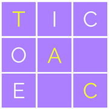

<div align="center">
  
</div>

Tic-tac-toe without all the dependencies!

---

## Getting Started

These instructions will get you a copy of the project up and running on your local machine for development and testing purposes.

### Prerequisites

Requires [Node](https://nodejs.org/) to run the server. I recommend installing the LTS release with [nvm](https://github.com/creationix/nvm).

The client is built with modern JavaScript features, so needs to be run in a modern browser. Works in the latest versions of Chrome, Firefox, and Safari.

### Installing

clone the project

```
git clone git@github.com:forrest-akin/tic-tac-toe.git
```

install dependencies (only required to run tests)

```
npm install
```

start the server
```
npm start
```
and you're done! Now you can navigate to `localhost:1337` in your favorite browser and start playing!

## Running the tests

```
npm test
```
or to run tests with a coverage report
```
npm run test:coverage
```
### Latest Test Coverage Report
```
---------------------|----------|----------|----------|----------|-------------------|
File                 |  % Stmts | % Branch |  % Funcs |  % Lines | Uncovered Line #s |
---------------------|----------|----------|----------|----------|-------------------|
All files            |    88.41 |    79.41 |    85.04 |    90.09 |                   |
 components          |    70.89 |    18.18 |     62.5 |    75.38 |                   |
  board.js           |    81.82 |        0 |    71.43 |     87.5 |                 7 |
  button.js          |      100 |      100 |      100 |      100 |                   |
  cell.js            |       55 |        0 |    44.44 |    66.67 |     9,29,30,31,32 |
  createComponent.js |      100 |       50 |      100 |      100 |              5,27 |
  logo.js            |    57.14 |        0 |        0 |       80 |                 4 |
  resetButton.js     |       40 |      100 |       50 |       40 |          14,15,16 |
  row.js             |    33.33 |      100 |        0 |    33.33 |               5,7 |
  startButton.js     |       20 |      100 |        0 |       20 |        7,13,14,15 |
 dom                 |      100 |      100 |      100 |      100 |                   |
  dom.js             |      100 |      100 |      100 |      100 |                   |
 game                |     95.9 |     88.1 |    95.56 |       97 |                   |
  game.js            |    88.89 |    69.23 |     87.5 |       85 |          24,25,26 |
  minimax.js         |    94.87 |       95 |    92.86 |      100 |                12 |
  utils.js           |      100 |      100 |      100 |      100 |                   |
  wins.js            |      100 |      100 |      100 |      100 |                   |
 scenes              |    71.43 |      100 |    66.67 |    66.67 |                   |
  game.js            |    71.43 |      100 |    66.67 |    66.67 |             10,11 |
 state               |    92.59 |      100 |    92.31 |    91.67 |                   |
  state.js           |    92.59 |      100 |    92.31 |    91.67 |             27,28 |
 utils               |      100 |      100 |      100 |      100 |                   |
  utils.js           |      100 |      100 |      100 |      100 |                   |
---------------------|----------|----------|----------|----------|-------------------|
```

## Built With

* [Node](https://nodejs.org/) - a JavaScript runtime built on Chrome's V8 JavaScript engine
* [Vanilla JS](http://vanilla-js.com/) - the language of the web
* [Jest](https://jestjs.io/) - Delightful JavaScript Testing

## Contributing

Please follow the guidelines of this [Git Workflow](https://www.asmeurer.com/git-workflow/) to start contributing. TL;DR

1. fork the repo
2. branch off of master
3. commit changes to your branch
4. open a PR from your fork/branch to origin/master

## Authors

* **Forrest Akin** - *Initial work*
